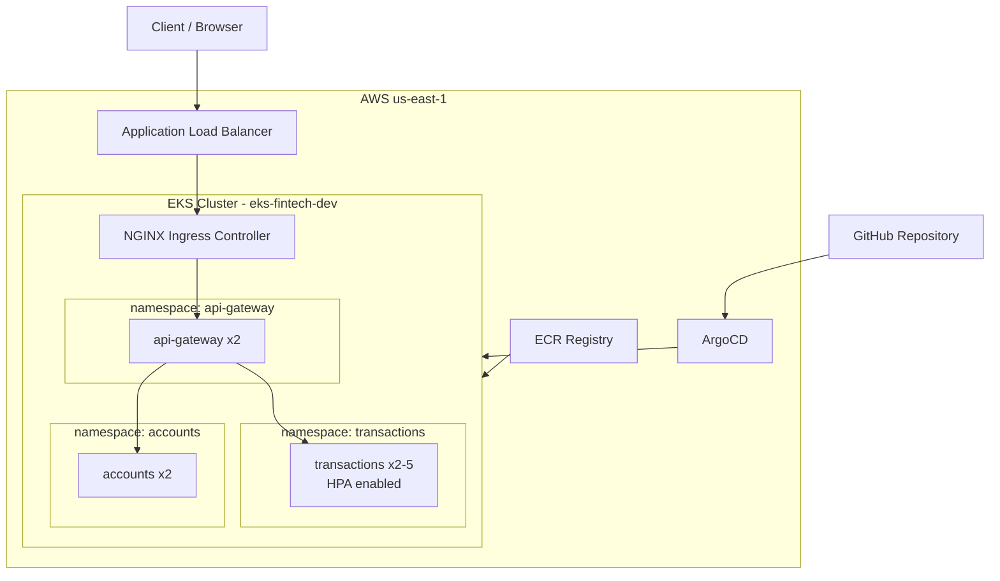
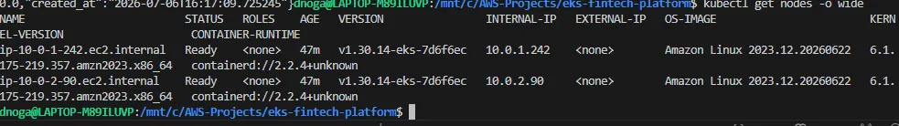
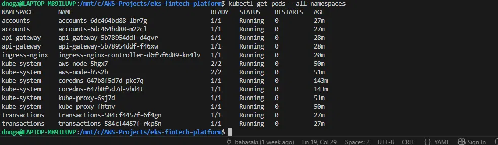
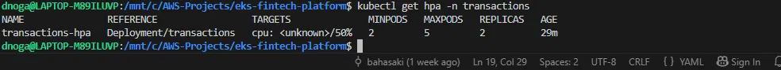
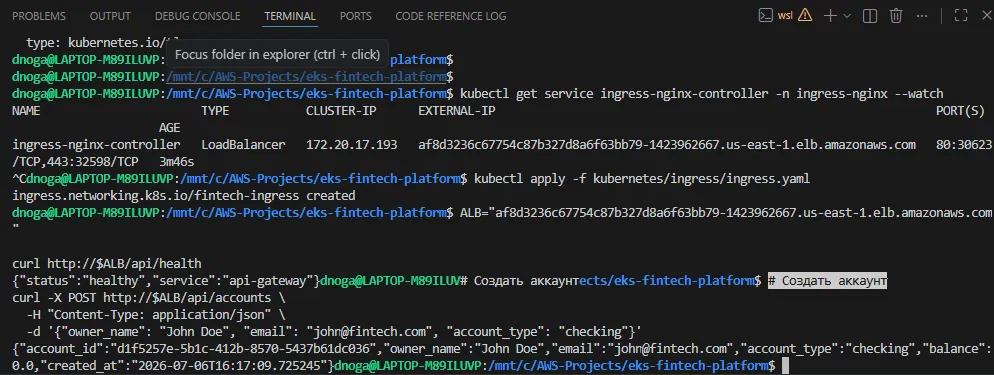

# EKS Fintech Platform

Production-grade microservices platform on AWS EKS, built with Terraform and GitOps principles.

## Architecture



## Tech Stack

- **Kubernetes** — EKS 1.30, kind (local)
- **Infrastructure** — Terraform (VPC, EKS modules)
- **GitOps** — ArgoCD
- **Services** — FastAPI (Python)
- **Registry** — AWS ECR
- **Ingress** — NGINX Ingress Controller + AWS ALB
- **CI/CD** — GitHub Actions (coming)

## Services

| Service | Description | Port |
|---------|-------------|------|
| api-gateway | Single entry point, routes to services | 8002 |
| accounts | Bank account management | 8000 |
| transactions | Transaction processing with HPA | 8001 |

## Kubernetes Features

| Feature | Implementation |
|---------|---------------|
| Multi-tenancy | 3 isolated namespaces |
| Security | RBAC — ServiceAccounts, Roles, RoleBindings |
| Auto-scaling | HPA on transactions (2-5 replicas, 50% CPU) |
| High Availability | Pod Anti-Affinity across nodes |
| GitOps | ArgoCD synced to GitHub |
| Zero-downtime deploy | Rolling updates |

## Infrastructure

**Worker Nodes:** 2x t3.small EC2 (Auto Scaling: 1-3)

## Local Development

```bash
# Start local cluster
kind create cluster --name fintech --config - <<EOF
kind: Cluster
apiVersion: kind.x-k8s.io/v1alpha4
nodes:
  - role: control-plane
  - role: worker
  - role: worker
EOF

# Deploy all services
kubectl apply -f kubernetes/namespaces/
kubectl apply -f kubernetes/accounts/
kubectl apply -f kubernetes/transactions/
kubectl apply -f kubernetes/api-gateway/
kubectl apply -f kubernetes/rbac/
kubectl apply -f kubernetes/ingress/

# Install ArgoCD
kubectl create namespace argocd
kubectl apply -n argocd -f https://raw.githubusercontent.com/argoproj/argo-cd/stable/manifests/install.yaml
kubectl apply -f argocd/
```

## AWS Deployment

```bash
# Bootstrap Terraform backend
aws s3 mb s3://tfstate-eks-fintech-<account-id> --region us-east-1
aws dynamodb create-table \
  --table-name tfstate-eks-fintech-lock \
  --attribute-definitions AttributeName=LockID,AttributeType=S \
  --key-schema AttributeName=LockID,KeyType=HASH \
  --billing-mode PAY_PER_REQUEST

# Deploy EKS
cd terraform/environments/dev
terraform init
terraform apply

# Configure kubectl
aws eks update-kubeconfig --name eks-fintech-dev --region us-east-1

# Push images to ECR
aws ecr get-login-password --region us-east-1 | \
  docker login --username AWS \
  --password-stdin <account-id>.dkr.ecr.us-east-1.amazonaws.com

docker build -t accounts-service:local services/accounts/
docker tag accounts-service:local <account-id>.dkr.ecr.us-east-1.amazonaws.com/accounts-service:latest
docker push <account-id>.dkr.ecr.us-east-1.amazonaws.com/accounts-service:latest

# Deploy to EKS
kubectl apply -f kubernetes/
kubectl apply -f argocd/

# Destroy when done
terraform destroy
```

## API Endpoints

```bash
# Health check
curl http://<ALB-DNS>/api/health

# Create account
curl -X POST http://<ALB-DNS>/api/accounts \
  -H "Content-Type: application/json" \
  -d '{"owner_name": "John Doe", "email": "john@example.com", "account_type": "checking"}'

# List accounts
curl http://<ALB-DNS>/api/accounts

# Create transaction
curl -X POST http://<ALB-DNS>/api/transactions \
  -H "Content-Type: application/json" \
  -d '{"account_id": "<id>", "amount": 500.00, "transaction_type": "deposit"}'
```

## Key Architectural Decisions

**Why microservices?**
Accounts and transactions have different scaling requirements. Transactions experience load spikes (paydays, holidays) requiring HPA, while accounts remain stable.

**Why ArgoCD over kubectl apply in CI/CD?**
GitOps ensures Git is the single source of truth. Any manual cluster changes are automatically reverted (selfHeal: true). Full audit trail via Git history.

**Why Pod Anti-Affinity?**
Ensures replicas are distributed across different nodes. If one node fails, the service remains available on the second node — critical for fintech availability requirements.

**Why private subnets for EKS nodes?**
Worker nodes are not directly accessible from the internet. All traffic flows through ALB → Ingress Controller → services. Reduces attack surface.

## Incident Scenarios Documented

| Incident | Cause | Resolution |
|----------|-------|------------|
| CrashLoopBackOff | Wrong resource limits | kubectl describe → logs → fix limits |
| 307 Redirect loop | FastAPI trailing slash | Added follow_redirects=True in httpx |
| Node group CREATE_FAILED | t3.medium not available | Changed to t3.small |
| Docker socket permission | User not in docker group | usermod -aG docker $USER |

## Screenshots

### EKS Cluster - Worker Nodes


### All Pods Running on EKS


### HPA - Autoscaling Configuration


### Live API on AWS ALB


## Cost

| Resource | Cost/hour | Notes |
|----------|-----------|-------|
| EKS Control Plane | $0.10 | |
| EC2 t3.small x2 | $0.046 | |
| NAT Gateway x2 | $0.09 | |
| ALB | $0.008 | |
| **Total** | **~$0.25/hr** | Destroy after demo |

## Author

**Baha** — Cloud/DevOps Engineer  
[GitHub](https://github.com/bahasaki) | [LinkedIn](#)