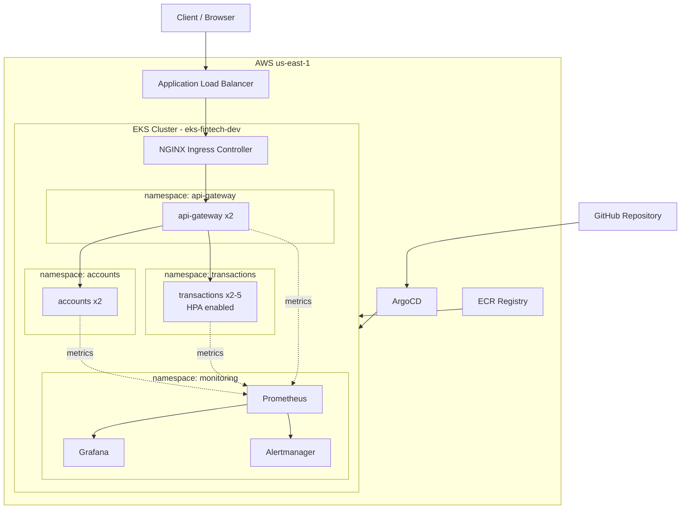
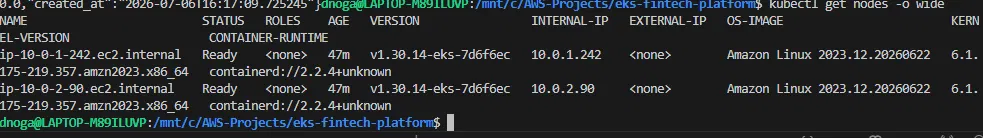
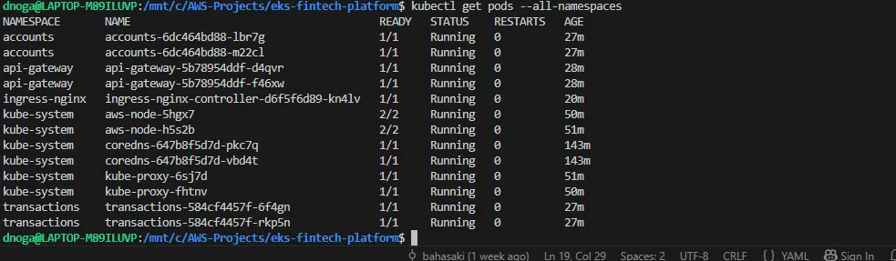
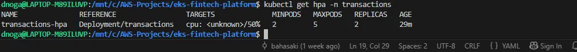
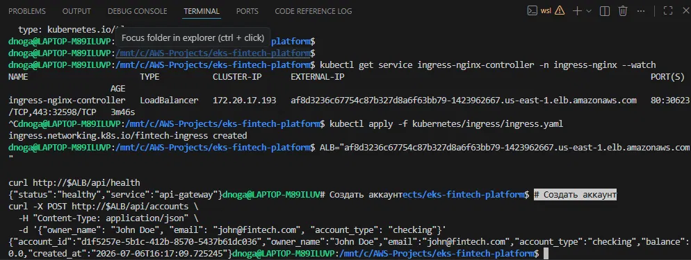

# EKS Fintech Platform

Production-grade microservices platform on AWS EKS, built with Terraform and GitOps principles.

## Architecture


```mermaid
graph TB
    Client[Client / Browser]
    
    subgraph AWS["AWS us-east-1"]
        ALB[Application Load Balancer]
        
        subgraph EKS["EKS Cluster - eks-fintech-dev"]
            NG[NGINX Ingress Controller]
            
            subgraph GW["namespace: api-gateway"]
                AGW[api-gateway x2]
            end
            
            subgraph AC["namespace: accounts"]
                ACC[accounts x2]
            end
            
            subgraph TR["namespace: transactions"]
                TRN[transactions x2-5\nHPA enabled]
            end

            subgraph MON["namespace: monitoring"]
                PROM[Prometheus]
                GRAF[Grafana]
                AM[Alertmanager]
            end
        end
        
        ECR[ECR Registry]
        ARG[ArgoCD]
    end
    
    GH[GitHub Repository]
    
    Client --> ALB
    ALB --> NG
    NG --> AGW
    AGW --> ACC
    AGW --> TRN
    ACC -.metrics.-> PROM
    TRN -.metrics.-> PROM
    AGW -.metrics.-> PROM
    PROM --> GRAF
    PROM --> AM
    GH --> ARG
    ARG --> EKS
    ECR --> EKS
```

## Tech Stack

- **Kubernetes** — EKS 1.30, kind (local)
- **Infrastructure** — Terraform (VPC, EKS modules)
- **GitOps** — ArgoCD
- **Services** — FastAPI (Python)
- **Registry** — AWS ECR
- **Ingress** — NGINX Ingress Controller + AWS ALB
- **Observability** — Prometheus, Grafana, Alertmanager (kube-prometheus-stack)
- **CI/CD** — GitHub Actions (OIDC → ECR, automatic manifest tag updates)

## Services

| Service | Description | Port |
|---------|-------------|------|
| api-gateway | Single entry point, routes to services | 8002 |
| accounts | Bank account management | 8000 |
| transactions | Transaction processing with HPA | 8001 |

## Kubernetes Features

| Feature | Implementation |
|---------|---------------|
| Multi-tenancy | 3 isolated namespaces |
| Security | RBAC — ServiceAccounts, Roles, RoleBindings |
| Auto-scaling | HPA on transactions (2-5 replicas, 50% CPU) |
| High Availability | Pod Anti-Affinity across nodes |
| GitOps | ArgoCD synced to GitHub |
| Zero-downtime deploy | Rolling updates |
| Observability | Prometheus metrics, Grafana dashboards, Alertmanager rules — see below |

## Observability

All three services expose Prometheus metrics via
`prometheus-fastapi-instrumentator` (RPS, error rate, request latency
histograms), scraped by Prometheus through per-service `ServiceMonitor`
CRDs. The entire stack — Helm release, dashboards, and alert rules — is
deployed and managed through ArgoCD, not manual `helm install` /
`kubectl apply`.

**Dashboard** — a custom Grafana dashboard ("Fintech Services
Overview") shows request rate, 5xx error rate, and p50/p95/p99 latency
per service. Deployed as a `ConfigMap` (dashboards-as-code), picked up
automatically by Grafana's sidecar.

**Alerts** — three `PrometheusRule` alerts: `HighErrorRate` (>5% 5xx
over 5m), `PodRestartLoop` (>3 restarts in 15m), `HighLatencyP95` (p95 >1s
over 5m). `PodRestartLoop` was validated end-to-end by deliberately
crash-looping a pod and confirming the alert transitioned
`INACTIVE → PENDING → FIRING → INACTIVE` and reached Alertmanager (see
[`docs/incidents/2026-07-14-alert-validation-podrestartloop.md`](docs/incidents/2026-07-14-alert-validation-podrestartloop.md)).

**Design decisions and trade-offs** — full context in
[`docs/adrs/004-observability-stack.md`](docs/adrs/004-observability-stack.md),
including why kube-prometheus-stack, why 2-day retention, why
dashboards/alerts are code rather than UI-configured, and known gaps
(e.g. api-gateway's outbound calls aren't separately instrumented).

**Runbook** — a reusable checklist for instrumenting a new FastAPI
service with Prometheus metrics lives at
[`docs/runbooks/runbook-instrument-fastapi-service.md`](docs/runbooks/runbook-instrument-fastapi-service.md).

### Accessing the dashboards locally

```bash
# Grafana (credentials: admin / see command below)
kubectl port-forward -n monitoring svc/kube-prometheus-stack-grafana 3000:80
kubectl get secret -n monitoring kube-prometheus-stack-grafana \
  -o jsonpath="{.data.admin-password}" | base64 --decode; echo

# Prometheus
kubectl port-forward -n monitoring svc/kube-prometheus-stack-prometheus 9090:9090

# Alertmanager
kubectl port-forward -n monitoring svc/kube-prometheus-stack-alertmanager 9093:9093
```

## CI/CD

GitHub Actions builds and pushes container images on every push to
`main` that touches `services/**`. A `detect-changes` job determines
which service(s) actually changed and builds a matrix dynamically —
only the affected service(s) get built, not all three.

```
git push (code change)
    ↓
detect-changes — dorny/paths-filter determines which service(s) changed
    ↓
build-and-push (matrix: only changed services)
    ├── Assume AWS IAM role via GitHub OIDC (no long-lived credentials)
    ├── docker build, tag with :latest and :<git-sha>
    ├── docker push to ECR
    └── sed-update the image tag in kubernetes/<service>/deployment.yaml,
        commit with [skip ci], push back to main
    ↓
ArgoCD (on next sync) picks up the new image tag from Git
```

Authentication uses a GitHub OIDC-federated IAM role
(`eks-fintech-github-actions-ecr-push-role`, scoped to push/pull only
on this project's three ECR repositories) rather than long-lived AWS
access keys stored as GitHub secrets.

CI intentionally does **not** deploy directly — it only builds, pushes
to ECR, and commits the new image tag back to Git. Deployment remains
ArgoCD's responsibility, consistent with [ADR-001](docs/adrs/001-argocd-gitops.md).

Two real bugs were hit and fixed while building this pipeline — a
matrix that silently "succeeded" without actually building two of
three services, and a `git rebase` ordering issue — both documented in
[`docs/incidents/2026-08-16-cicd-matrix-and-rebase-bugs.md`](docs/incidents/2026-08-16-cicd-matrix-and-rebase-bugs.md).

## Infrastructure

**Worker Nodes:** 2x t3.small EC2 (Auto Scaling: 1-3)

## Local Development

```bash
# Start local cluster
kind create cluster --name fintech --config - <<EOF
kind: Cluster
apiVersion: kind.x-k8s.io/v1alpha4
nodes:
  - role: control-plane
  - role: worker
  - role: worker
EOF

# Deploy all services
kubectl apply -f kubernetes/namespaces/
kubectl apply -f kubernetes/accounts/
kubectl apply -f kubernetes/transactions/
kubectl apply -f kubernetes/api-gateway/
kubectl apply -f kubernetes/rbac/
kubectl apply -f kubernetes/ingress/

# Install ArgoCD
kubectl create namespace argocd
kubectl apply -n argocd -f https://raw.githubusercontent.com/argoproj/argo-cd/stable/manifests/install.yaml
kubectl apply -f argocd/

# ArgoCD manages the monitoring stack too — kube-prometheus-stack Helm
# release + custom dashboards/alerts both sync automatically once
# argocd/kube-prometheus-stack-app.yaml and
# argocd/monitoring-extras-app.yaml are applied (included in argocd/ above).
```

## AWS Deployment

Full step-by-step provisioning and teardown checklist:
[`docs/runbooks/runbook-eks-provision-and-teardown.md`](docs/runbooks/runbook-eks-provision-and-teardown.md).

```bash
# Bootstrap Terraform backend
aws s3 mb s3://tfstate-eks-fintech-<account-id> --region us-east-1
aws dynamodb create-table \
  --table-name tfstate-eks-fintech-lock \
  --attribute-definitions AttributeName=LockID,AttributeType=S \
  --key-schema AttributeName=LockID,KeyType=HASH \
  --billing-mode PAY_PER_REQUEST

# Deploy EKS
cd terraform/environments/dev
terraform init
terraform apply

# Configure kubectl
aws eks update-kubeconfig --name eks-fintech-dev --region us-east-1

# Push images to ECR
aws ecr get-login-password --region us-east-1 | \
  docker login --username AWS \
  --password-stdin <account-id>.dkr.ecr.us-east-1.amazonaws.com

docker build -t accounts-service:local services/accounts/
docker tag accounts-service:local <account-id>.dkr.ecr.us-east-1.amazonaws.com/accounts-service:latest
docker push <account-id>.dkr.ecr.us-east-1.amazonaws.com/accounts-service:latest

# Deploy to EKS
kubectl apply -f kubernetes/
kubectl apply -f argocd/

# Destroy when done — see runbook above for the safe teardown order
# (LoadBalancer Service must be deleted before terraform destroy)
terraform destroy
```

> **Note:** `kubernetes/*/deployment.yaml` files currently point at
> local dev images (`imagePullPolicy: Never`) for kind development —
> see [`docs/incidents/2026-07-10-accounts-imagepullbackoff.md`](docs/incidents/2026-07-10-accounts-imagepullbackoff.md). Before
> deploying to EKS, these need to be switched back to the ECR image
> references shown above.

## API Endpoints

```bash
# Health check
curl http://<ALB-DNS>/api/health

# Create account
curl -X POST http://<ALB-DNS>/api/accounts \
  -H "Content-Type: application/json" \
  -d '{"owner_name": "John Doe", "email": "john@example.com", "account_type": "checking"}'

# List accounts
curl http://<ALB-DNS>/api/accounts

# Create transaction
curl -X POST http://<ALB-DNS>/api/transactions \
  -H "Content-Type: application/json" \
  -d '{"account_id": "<id>", "amount": 500.00, "transaction_type": "deposit"}'
```

## Architecture Decision Records

| ADR | Decision |
|-----|----------|
| [001](docs/adrs/001-argocd-gitops.md) | ArgoCD (GitOps) over manual `kubectl apply` |
| [002](docs/adrs/002-local-kind-before-eks.md) | Develop locally on kind before deploying to EKS |
| [003](docs/adrs/003-microservices-not-monolith.md) | Three services instead of a monolith |
| [004](docs/adrs/004-observability-stack.md) | Observability stack (kube-prometheus-stack) |
| [005](docs/adrs/005-pod-anti-affinity.md) | Pod Anti-Affinity for transactions HA |

**Why microservices?**
Accounts and transactions have different scaling requirements. Transactions experience load spikes (paydays, holidays) requiring HPA, while accounts remain stable. Full reasoning: [ADR-003](docs/adrs/003-microservices-not-monolith.md).

**Why ArgoCD over kubectl apply in CI/CD?**
GitOps ensures Git is the single source of truth. Any manual cluster changes are automatically reverted (selfHeal: true). Full audit trail via Git history. Full reasoning: [ADR-001](docs/adrs/001-argocd-gitops.md).

**Why Pod Anti-Affinity?**
Ensures replicas are distributed across different nodes. If one node fails, the service remains available on the second node — critical for fintech availability requirements. Full reasoning: [ADR-005](docs/adrs/005-pod-anti-affinity.md).

**Why private subnets for EKS nodes?**
Worker nodes are not directly accessible from the internet. All traffic flows through ALB → Ingress Controller → services. Reduces attack surface.

**Why develop on kind before EKS?**
Every debugging cycle on a local cluster costs nothing; the same cycle against a live EKS cluster accumulates real AWS spend regardless of whether the issue is a typo or a real bug. Full reasoning: [ADR-002](docs/adrs/002-local-kind-before-eks.md).

**Why kube-prometheus-stack for observability, and why is it split into two ArgoCD Applications?**
See [ADR-004](docs/adrs/004-observability-stack.md) for full reasoning — short version: the Helm chart bundles the operator and CRDs needed for ServiceMonitor/PrometheusRule, and splitting the chart itself from the custom dashboards/alerts keeps an external dependency's release cycle separate from project-specific, frequently-changing content.

## Runbooks

| Runbook | Purpose |
|---------|---------|
| [EKS provision and teardown](docs/runbooks/runbook-eks-provision-and-teardown.md) | Full checklist for standing up and safely tearing down the EKS cluster without leaving orphaned AWS resources |
| [Instrument a FastAPI service with metrics](docs/runbooks/runbook-instrument-fastapi-service.md) | Reusable steps for adding Prometheus metrics to a new service |

## Incidents Documented

| Incident | Cause | Resolution |
|----------|-------|------------|
| [307 Redirect → JSONDecodeError](docs/incidents/2026-06-25-api-gateway-307-redirect.md) | FastAPI trailing-slash redirect not followed by httpx proxy client | Added `follow_redirects=True`, fixed path-joining logic |
| [EKS node group CREATE_FAILED](docs/incidents/2026-07-06-eks-nodegroup-create-failed.md) | `t3.medium` not Free-Tier eligible on this account | Changed default `instance_types` to `t3.small` |
| [terraform destroy blocked — VPC DependencyViolation](docs/incidents/2026-07-06-terraform-destroy-vpc-dependency.md) | Orphaned classic ELB (created by Kubernetes, not Terraform) held ENIs in the VPC's subnets | Deleted the ELB and VPC manually, then `terraform state rm` to resync state |
| [ImagePullBackOff (accounts, api-gateway)](docs/incidents/2026-07-10-accounts-imagepullbackoff.md) | Deployment manifests referenced ECR images unreachable from kind (no IAM auth on kind nodes) | Built local `:dev` images, `kind load docker-image`, switched manifests to `imagePullPolicy: Never` |
| [Recurring late-night namespace restarts](docs/incidents/2026-07-10-late-night-namespace-restarts.md) | Docker Desktop/WSL2 instability, not a Kubernetes-level issue | Recognized as a self-resolving environmental pattern; no longer investigated fresh each time |
| [Docker Desktop credsStore hang](docs/incidents/2026-07-12-docker-credstore-hang.md) | `desktop.exe` credential helper hung, blocking even public-image pulls | Temporarily stripped `credsStore` from `~/.docker/config.json` |
| [PodRestartLoop alert validation](docs/incidents/2026-07-14-alert-validation-podrestartloop.md) | N/A — deliberate end-to-end test of the alerting pipeline | Confirmed `INACTIVE → PENDING → FIRING → INACTIVE` lifecycle and Alertmanager delivery |
| [values-kind.yaml never committed to Git](docs/incidents/2026-08-02-values-file-never-committed.md) | File existed and worked locally (used by manual `helm install`) but was never actually `git add`-ed | Committed the file; confirmed with `git show HEAD:<path>` before assuming any file is tracked |
| [Release-label mismatch after Helm rename](docs/incidents/2026-08-03-release-label-mismatch.md) | ArgoCD migration renamed the Helm release (`prometheus` → `kube-prometheus-stack`), silently breaking the `release` label match on all ServiceMonitors/PrometheusRule | Updated the `release` label across all four manifests to match the new release name |
| [CI/CD matrix skip-logic and git rebase bugs](docs/incidents/2026-08-16-cicd-matrix-and-rebase-bugs.md) | Per-step `if:` conditions reported job success even when steps were skipped; `git pull --rebase` ran after a file-modifying step instead of before | Rebuilt the matrix dynamically from changed-service detection; reordered rebase to run before `sed` touches any file |

## Screenshots

### EKS Cluster - Worker Nodes


### All Pods Running on EKS


### HPA - Autoscaling Configuration


### Live API on AWS ALB


## Cost

| Resource | Cost/hour | Notes |
|----------|-----------|-------|
| EKS Control Plane | $0.10 | |
| EC2 t3.small x2 | $0.046 | |
| NAT Gateway x2 | $0.09 | |
| ALB | $0.008 | |
| **Total** | **~$0.25/hr** | Destroy after demo — see [teardown runbook](docs/runbooks/runbook-eks-provision-and-teardown.md) |

## Author

**Baha** — Cloud/DevOps Engineer  
[GitHub](https://github.com/bahasaki) | [LinkedIn](#)
